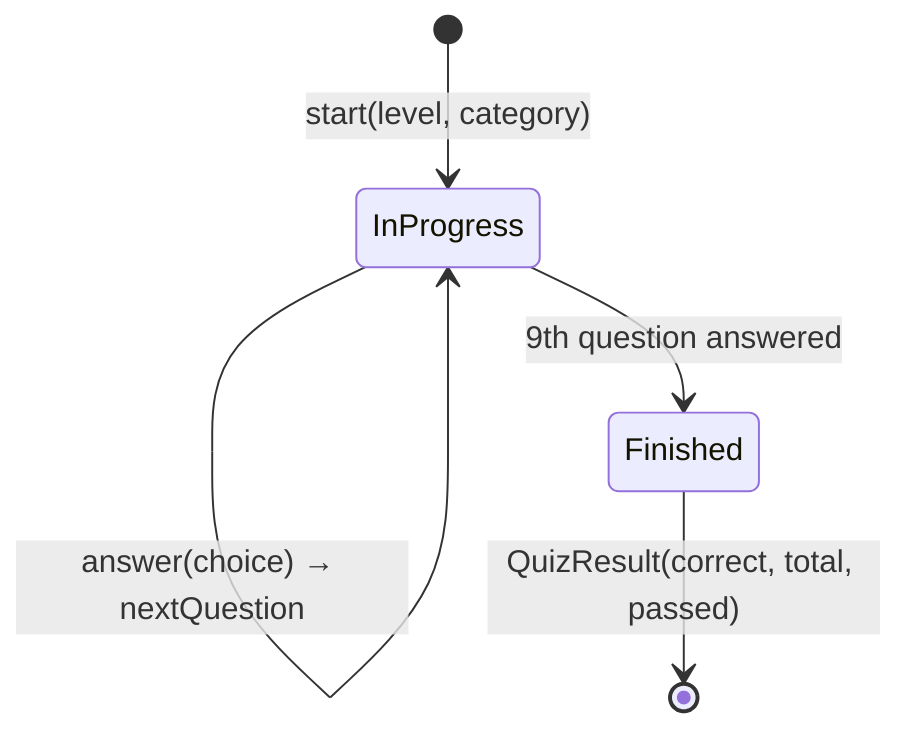
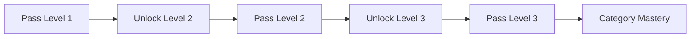

# Edubba Tablet PY 🟢

A configurable, fully offline quiz app for learning to code — built in Flutter, powered entirely by a JSON content file.

`Edubba Tablet PY` is the first release in the **Edubba Tablet** family: the same engine re-themed per subject (Python today, C#/JS/Networks planned) by swapping one JSON file and one config object — no branching, no forking.

The name is a small homage: in ancient Mesopotamia, the *edubba* ("tablet house") was where young scribes were trained by writing on clay tablets. The modern equivalent of a scribe is a junior engineer — and the app's icon is a stack of tablets for exactly that reason.

---

## ✨ Features

**Core**
- **Topic-agnostic quiz engine** — the entire question set, categories, and copy come from a bundled JSON asset. Retheme the app by swapping the JSON and one config file.
- **Structured progression** — 5 categories × 3 levels (Novice / Intermediate / Advanced), 9 questions per level, pass at 8/9.
- **Offline-first** — no backend, no network calls, no accounts. Progress is stored on-device via `shared_preferences`.
- **Code-aware questions** — questions can be plain text or include a syntax-highlighted code snippet.
- **Share your result** — generates a shareable summary string per level attempt.

**Content**
- Rich per-question metadata: category, level, type, tags, source reference, and a written explanation shown after answering.
- Built-in validation layer — malformed questions (missing choices, out-of-range index, etc.) are rejected at load time with a clear error, not a silent crash.

---

## 🧱 Tech stack

| Layer | Technology |
|---|---|
| Framework | Flutter (stable), Dart, Material 3 |
| State | Plain Dart classes + `setState` / `FutureBuilder` — no external state library |
| Persistence | `shared_preferences` |
| Sharing | `share_plus` |
| Linting | `flutter_lints` |
| Content | Static JSON asset, versioned schema |
| Distribution | Android App Bundle (`.aab`), Play App Signing |

No backend, no database, no external API — the entire app ships in the binary.

---

## 🗂️ Architecture

```
lib/
├── config/         # compile-time app identity ("which topic")
│   ├── quiz_config.dart        # QuizConfig type
│   └── app_quiz_config.dart    # the single active config instance
├── domain/         # pure Dart game logic — no Flutter imports, unit-testable
│   ├── level_rules.dart        # levels, question counts, pass threshold
│   ├── quiz_engine.dart        # state machine: start → answer → next → finish
│   └── quiz_state.dart         # immutable QuizState / QuizResult
├── models/
│   ├── question.dart           # Question + QuestionBank (JSON parsing)
│   ├── quiz_category.dart
│   └── app_progress.dart       # persisted progress + derived stats
├── services/
│   ├── question_loader.dart    # loads the JSON asset
│   ├── question_repository.dart# caches + validates + samples questions
│   ├── question_validator.dart # per-question schema validation
│   ├── progress_service.dart   # progress rules
│   ├── progress_store.dart     # shared_preferences read/write
│   └── share_text_builder.dart # builds the "share result" string
├── theme/
│   └── app_theme.dart          # brand palette + dark ThemeData
├── screens/        # home, quiz, result, debug_questions
└── widgets/        # answer_button, question_card, progress_bar, explanation_card
```

`domain/` is deliberately Flutter-free — the entire scoring and progression logic can be unit tested without a widget tree.

---

## 📋 Content contract (the quiz JSON)

Every quiz is one JSON asset with this shape:

```json
{
  "version": 1,
  "categories": [{ "id": 1, "title": "Basics", "description": "..." }],
  "questions": [
    {
      "id": "C1-L1-01",
      "categoryId": 1,
      "level": 1,
      "type": "syntax",
      "questionFormat": "text",
      "question": "Which operator is used for multiplication?",
      "codeLanguage": null,
      "codeSnippet": null,
      "choices": ["X", "^", "*", "**"],
      "correctIndex": 2,
      "tags": ["operators"],
      "sourceRef": "docs.python.org",
      "explanation": "The asterisk (*) is the standard multiplication operator."
    }
  ]
}
```

**Validation rules** (enforced at load time, not just hopefully true):
- `categoryId` 1–5, `level` 1–3
- exactly 4 non-empty `choices`, `correctIndex` in range
- `codeFormat: "code"` questions must include a `codeSnippet`
- at least **9 valid questions per (level, category) pair** — the minimum needed to run a full level

---

## 🔁 Quiz session flow



A `QuizResult` (8/9+ = passed) feeds directly into progress rules:



---

## 🚀 Installation

```bash
# Clone
git clone https://github.com/buhovac/edubba-tablet-py.git
cd edubba-tablet-py

# Install dependencies
flutter pub get

# Run
flutter run
```

### Build a release Android App Bundle

```bash
flutter build appbundle
# → build/app/outputs/bundle/release/app-release.aab
```

Release builds are signed via a local `android/key.properties` (gitignored) referencing an upload keystore — see `CLAUDE.md` for the full signing setup if you're setting this up from scratch.

---

## ✅ Requirements

- Flutter (stable channel)
- Android SDK (for Android builds) — no iOS/Xcode setup required unless targeting iOS
- No API keys, no backend, no environment variables — the app is fully self-contained

---

## 🎨 Branding

| | |
|---|---|
| Accent green | `#BEEF35` |
| Charcoal | `#353535` |
| Concept | Stacked clay tablets, cascading from muted gray → olive → brand green, with engraved wedge-mark accents |

---

It also doubles as a public build log: development is documented for a YouTube tutorial series, and the Play Store release is a deliberate dry run of the full publishing pipeline — signing, store listing, and compliance — for reuse across the next apps in the series.

Built and maintained by [Nov Inicium SRL](https://novinicium.be).
